# System Architecture Map - Current State Analysis

## Current System Fragmentation

```mermaid
graph TB
    subgraph "Entry Points (7 different main scripts)"
        A[runner.py - Original Core]
        B[runner_fixed.py - Demo Wrapper] 
        C[runner_continuous.py - Incomplete]
        D[RUN_AUTO.py - Auto Launcher]
        E[run_complete_system.py - Orchestrator]
        F[SIMPLE_RUN.py - Test Runner]
        G[start_continuous_mining.py - Service]
    end
    
    subgraph "Demo/Test Components (Not Production)"
        H[gpu_asic_hybrid_demo.py]
        I[asic_hardware_emulation.py]
        J[performance_optimizer.py]
        K[test_*.py files]
        L[professional_demo.py]
    end
    
    subgraph "Code Quality Tools (Fragmented)"
        M[super_auto_fixer.py - REMOVED]
        N[advanced_auto_fixer.py - REMOVED]
        O[working_auto_fixer.py - REMOVED]
        P[auto_fix_all.py - REMOVED]
        Q[critical_syntax_fixer.py - REMOVED]
        R[fix_try_except.py - REMOVED]
    end
    
    subgraph "Configuration Chaos"
        S[.env.example - Unused]
        T[mining_constants.py - Incomplete]
        U[economic_config.py - Partial]
        V[Hardcoded values everywhere]
    end
    
    subgraph "Missing Production Core"
        W[❌ Proper Stratum V1]
        X[❌ ASIC Hardware Interface]
        Y[❌ Pool Failover]
        Z[❌ State Management]
        AA[❌ Service Architecture]
    end
    
    A -.-> W
    B -.-> H
    C -.-> X
    D --> A
    E --> B
    F --> H
    G -.-> Y
    
    style A fill:#ffcccc
    style W fill:#ff6666
    style X fill:#ff6666
    style Y fill:#ff6666
    style Z fill:#ff6666
    style AA fill:#ff6666
```

## What Production Architecture Should Look Like

## Key Differences: Current vs Production-Ready

| Aspect | Current State | Production Needed |
|--------|---------------|-------------------|
| **Entry Points** | 7 different main scripts | 1 unified service |
| **Architecture** | Scripts calling scripts | Service-oriented architecture |
| **Configuration** | Scattered across files | Centralized config management |
| **Error Handling** | Basic try/catch | Structured error handling |
| **Monitoring** | Basic Prometheus | Comprehensive observability |
| **Testing** | Demo scripts only | Full test suite |
| **Deployment** | Manual execution | Automated deployment |
| **Security** | None | Comprehensive security |
| **Scalability** | Single process | Horizontally scalable |
| **Maintenance** | Manual intervention | Self-healing |

## File Classification

### 🟢 Production-Ready Components (None Currently)
- *(No files in current codebase meet production standards)*

### 🟡 Partially Usable (Need Major Refactoring)
- `runner.py` - Core mining logic exists but needs complete rewrite
- `asic_monitor.py` - Basic monitoring, needs enhancement
- `economic_guardian.py` - Economic logic exists but incomplete

### 🔴 Demo/Test Only (Not for Production)
- All `*_demo.py` files
- All `test_*.py` files  
- All `*_fixer.py` files
- All launcher scripts (`RUN_*.py`, `SIMPLE_RUN.py`)
- All batch files (`*.bat`)

### 🟠 Configuration/Documentation
- All `*.md` files (documentation)
- `requirements.txt`, `pyproject.toml` (dependencies)
- `.env.example` (configuration template)

This analysis clearly shows why the system is not production-ready: it's a collection of demos and incomplete implementations without a unified, production-grade architecture.