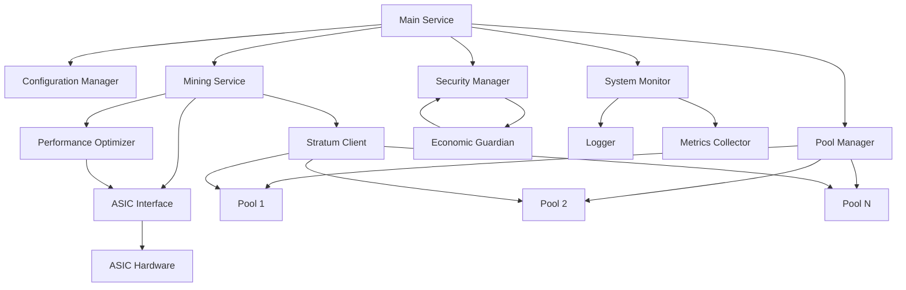

# Scrypt DOGE Mining System Architecture

## Overview

The Scrypt DOGE Mining System is a production-ready cryptocurrency mining solution designed for Dogecoin (DOGE) and Litecoin (LTC) mining using the Scrypt algorithm. The system follows a modular, clean architecture with separation of concerns and implements advanced features for security, performance, and economic optimization.

## System Components

### 1. Core Components

#### Main Service (`core/main_service.py`)
- Entry point for the entire mining system
- Manages the lifecycle of all subsystems
- Handles graceful startup and shutdown
- Coordinates between different components

#### Configuration Manager (`core/config_manager.py`)
- Centralized configuration management
- Supports multiple environments (development, staging, production)
- Environment variable integration
- Configuration validation and hot-reload capabilities

#### Mining Service (`core/mining_service.py`)
- Core mining logic implementation
- Coordinates between Stratum client and hardware interfaces
- Manages mining workflows and job processing

### 2. Network Components

#### Stratum Client (`network/stratum_client.py`)
- Enhanced Stratum V1 protocol implementation
- Secure connection with TLS support
- Real-time difficulty adjustment
- Share submission and validation
- Advanced security features

#### Pool Manager (`network/pool_manager.py`)
- Multiple pool support with priority-based failover
- Circuit breaker pattern for resilience
- Automatic reconnection with exponential backoff
- Pool latency monitoring

### 3. Security Components

#### Security Manager (`security/security_manager.py`)
- Encryption and decryption of sensitive data
- Rate limiting to prevent abuse
- DDoS protection mechanisms
- Input validation and sanitization
- TLS/SSL enforcement

#### Economic Guardian (`security/economic_guardian.py`)
- Real-time profitability calculations
- Automatic shutdown on unprofitability
- Configurable economic thresholds
- Market data integration

### 4. Hardware Components

#### ASIC Emulator (`hardware/asic_emulator.py`)
- Hardware emulation for development and testing
- Power measurement simulation
- Thermal management
- Fan control simulation

#### ASIC Interface (`hardware/asic_interface.py`)
- Real ASIC hardware integration using pyasic
- Hardware monitoring and control
- Temperature and power management

### 5. Monitoring Components

#### System Monitor (`monitoring/system_monitor.py`)
- Comprehensive system metrics collection
- Performance monitoring
- Health checks
- Resource utilization tracking

#### Logger (`utils/logger.py`)
- Structured JSON logging
- Log rotation and retention
- Alerting mechanisms
- Performance metrics logging

### 6. Optimization Components

#### Performance Optimizer (`optimization/performance_optimizer.py`)
- GPU performance optimization
- Voltage-frequency tuning
- Clock gating implementation
- Efficiency measurement and improvement

## System Architecture Diagram

## Data Flow

1. **System Initialization**
   - Main service loads configuration
   - Initializes all subsystems
   - Starts monitoring and security components

2. **Mining Workflow**
   - Connects to primary mining pool
   - Receives mining jobs from pool
   - Processes jobs using hardware interface
   - Submits shares back to pool
   - Monitors performance and profitability

3. **Failover Process**
   - Detects pool connection issues
   - Activates circuit breaker pattern
   - Attempts reconnection with exponential backoff
   - Fails over to backup pools if needed

4. **Monitoring and Alerting**
   - Collects system metrics continuously
   - Logs events and performance data
   - Sends alerts for critical issues
   - Tracks economic profitability

## Security Features

- **Encryption**: Sensitive data encryption using Fernet
- **Rate Limiting**: Request rate limiting to prevent abuse
- **DDoS Protection**: Protection against distributed denial-of-service attacks
- **Input Validation**: Comprehensive input validation and sanitization
- **TLS/SSL**: Secure communication with mining pools
- **Access Control**: IP-based access control lists

## Performance Optimization

- **L2 Resident Kernel**: Memory-bound kernel optimization
- **Voltage Tuning**: Dynamic voltage adjustment for efficiency
- **Clock Gating**: Dynamic clock gating during memory phases
- **Algorithm Switching**: Automatic algorithm switching for optimal performance
- **Benchmarking**: Performance benchmarking and validation

## Economic Safeguards

- **Profitability Monitoring**: Real-time profitability calculations
- **Automatic Shutdown**: Automatic shutdown when unprofitable
- **Power Cost Management**: Power cost monitoring and optimization
- **Market Integration**: Cryptocurrency market data integration

## Deployment Options

- **Standalone**: Direct installation on mining hardware
- **Docker**: Containerized deployment
- **Kubernetes**: Orchestrated deployment with scaling capabilities
- **Cloud**: Cloud-based deployment options

## Monitoring and Observability

- **Metrics Collection**: Comprehensive metrics collection
- **Health Checks**: System health monitoring
- **Logging**: Structured JSON logging with rotation
- **Alerting**: Alerting mechanisms for critical events
- **Performance Tracking**: Performance metrics tracking

## Testing

- **Unit Tests**: Comprehensive unit test coverage
- **Integration Tests**: Component integration testing
- **Performance Tests**: Performance benchmarking
- **Security Tests**: Security vulnerability testing